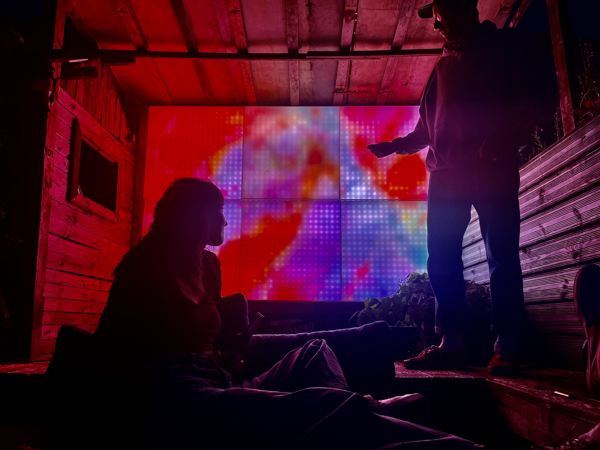
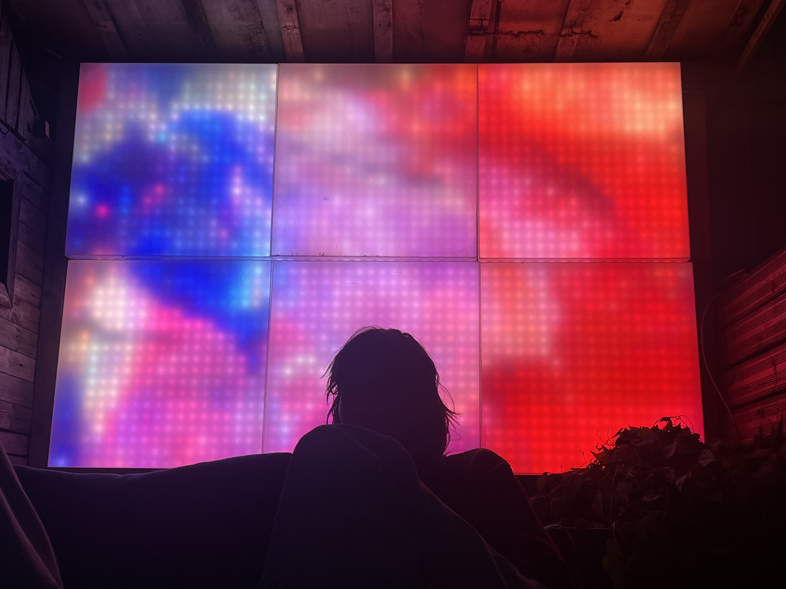

# Insta-inet Control Panel

A reverse-engineered driver and Qt-based control application for Instalight 2022 LED panels, developed to give new life to discarded equipment for community use.

## 🌟 Project Overview

This project represents a complete reverse-engineering effort of the proprietary "Insta-inet" protocol used by Instalight 2022 LED panels. Instead of letting these panels end up in landfills, this driver enables communities to repurpose them for displays, art installations, and educational projects.


*Instalight 2022 LED panels in operation at Pandora 2.0 community center*


*Close-up view of the LED panel display showing the grid-based content distribution*

### Key Features

- **Complete Protocol Implementation**: Fully reverse-engineered Insta-inet protocol driver
- **Network Discovery**: Automatic detection of panels on the network
- **Real-time Camera Input**: Live camera feed processing and display
- **Video File Playback**: Support for video file rendering to panels
- **Advanced Controls**: Fine-tuned brightness, contrast, luminance, frequency, and RGB controls
- **Grid-based Layout**: Support for multi-panel arrangements (up to 4x4 grid)
- **Qt GUI**: User-friendly interface with real-time controls

## 🛠️ Technical Architecture

### Core Components

#### Protocol Driver (`insta-inet.h/cpp`)
- **DataPacket Structure**: Complete packet format with RGB data for left/right channels
- **Panel Configuration**: Brightness, contrast, luminance time, frequency, and RGB max values
- **UDP Communication**: Reliable packet transmission to panels
- **Frame Rendering**: Optimized frame-to-panel data conversion

#### Network Discovery (`discovery.h`)
- **Non-blocking Discovery**: Asynchronous panel detection
- **Custom Discovery Packets**: Reverse-engineered discovery protocol
- **IP Management**: Automatic IP address collection and management

#### Camera Integration (`cameraworker.h`)
- **Real-time Capture**: OpenCV-based camera frame acquisition
- **Frame Processing**: Automatic cropping and grid-based frame distribution
- **Threading Support**: Non-blocking camera operations with pause/resume/stop controls

#### Video Rendering (`video_renderer.h`)
- **File Playback**: Support for various video formats via OpenCV
- **Frame-by-frame Processing**: Synchronized video-to-panel rendering
- **Grid Integration**: Automatic frame distribution across panel grid

#### GUI Controller (`inetcontroler.h`)
- **Real-time Controls**: Live adjustment of panel parameters
- **Visual Feedback**: Interactive grid representation
- **File Management**: Easy video file selection and loading

## 🚀 Getting Started

### Prerequisites

- Qt 6.x development environment
- OpenCV 4.x
- C++17 compatible compiler
- Network access to Instalight 2022 panels

### Dependencies

```bash
# macOS (using Homebrew)
brew install qt opencv

# Ubuntu/Debian
sudo apt-get install qt6-base-dev libopencv-dev

# Build system
qmake or CMake support
```

### Building

```bash
# Using qmake
qmake inetControlPanel.pro
make

# The built application will be in build/Qt_6_9_1_for_macOS-Debug/inetControlPanel.app/
```

## 📖 Usage Guide


*The Qt-based control panel interface showing grid layout, camera controls, and panel parameter sliders*

### 1. Panel Discovery

1. Connect your panels to the same network as your computer
2. Launch the application
3. Click "Scan" to discover available panels
4. Discovered panels will appear in the grid interface

### 2. Camera Mode

1. Check "Camera Input" to enable live camera feed
2. Configure your grid size (rows/columns of panels)
3. The camera feed will be automatically cropped and distributed across panels
4. Use pause/resume controls as needed

### 3. Video Playback

1. Click "Select Path" to choose a video file
2. Click "Render" to start playback
3. Video frames will be distributed across the panel grid

### 4. Panel Configuration

Use the sliders to adjust:
- **Brightness**: Overall panel brightness (0-255)
- **Contrast**: Image contrast adjustment (0-255)
- **Luminance**: Timing controls for LED refresh (0-255)
- **Frequency**: Panel refresh frequency (0-255)
- **RGB Max Values**: Individual channel maximum values for color calibration

## 🔧 Protocol Documentation

### Insta-inet Packet Structure

The Insta-inet protocol consists of three main packet types: Discovery, Discovery Reply, and Data packets. All communication occurs over UDP.

**📋 Additional Protocol Information:** For detailed packet analysis, field mappings, and additional protocol documentation, refer to `insta-inet protocol documentation/INSTA-INET packets.xlsx` which contains comprehensive packet breakdowns and reverse-engineering notes.

#### 1. Discovery Packet (Panel Detection)

The discovery packet is broadcast to UDP port 9410 to locate panels on the network:

```cpp
struct DiscoveryPacket {
    uint8_t Insta_identifier[10] = {0x49, 0x4E, 0x53, 0x54, 0x41, 0x2D, 0x49, 0x4E, 0x45, 0x54}; // "INSTA-INET"
    uint8_t nul_terminator = 0x00;
    uint8_t version[2] = {0x01, 0x00};          // Protocol version
    uint8_t sendIndicator[2] = {0x00, 0x03};    // Discovery operation indicator
    uint8_t hostIP[5] = {0xC0, 0xA8, 0x02, 0xA7, 0x00}; // Host IP (192.168.2.167) with null terminator
    uint8_t op = 0x02;                          // Discovery operation code
    uint8_t unknown[5] = {0x55, 0x00, 0x00, 0x00, 0x00}; // Unknown/padding fields
};
```

**Discovery Process:**
1. Broadcast this packet to the network (255.255.255.255:9410)
2. Panels respond with their IP addresses and status
3. The `hostIP` field should contain your computer's IP address
4. Panels use this information to establish communication

#### 2. Discovery Reply Packet (Panel Response)

Panels respond to discovery requests with their network information. The reply contains:
- Panel's IP address ✅
- Panel status and capabilities ❓
- Network configuration details ✅

**IP Extraction:** The panel's IP address is extracted from the reply packet (byte 30-33), allowing the application to build a list of available panels for subsequent data transmission.

#### 3. Data Packet (Frame Transmission)

The main data packet structure used for sending RGB frame data and control parameters:

```cpp
struct DataPacket {
    uint8_t Insta_identifier[11] = {0x49, 0x4E, 0x53, 0x54, 0x41, 0x2D, 0x49, 0x4E, 0x45, 0x54, 0x00}; // "INSTA-INET\0"
    uint8_t version[2] = {0x01, 0x00};          // Protocol version
    uint8_t unknown0[2] = {0x00, 0x01};         // Unknown fields
    uint8_t TargetIP[5] = {0x00, 0x00, 0x00, 0x00, 0x00}; // Target panel IP with null terminator
    uint8_t op[2] = {0x01, 0x00};               // Data operation code
    uint8_t unknown1[2] = {0x01, 0x21};         // Unknown fields
    uint8_t counter = 0x00;                     // Frame counter (increments with each frame)
    uint8_t unknown2[9] = {0,0, 0,0,1,0xE6,0,0x1A,0}; // Unknown/timing fields
    
    // Left Channel Data (486 bytes total)
    uint8_t RGB_Left[162*3];         // RGB data for 162 LEDs (486 bytes)
    uint8_t L_Brightness = 0xC1;     // Left channel brightness (0-255)
    uint8_t L_Contrast = 0x7D;       // Left channel contrast (0-255)
    uint8_t L_Lumin_Time = 0x00;     // Left channel luminance timing (0-255)
    uint8_t L_Freq = 0x00;           // Left channel frequency (0-255)
    uint8_t L_Red_max = 0xFF;        // Left channel red maximum (0-255)
    uint8_t L_Green_max = 0xFF;      // Left channel green maximum (0-255)
    uint8_t L_Blue_max = 0xFF;       // Left channel blue maximum (0-255)
    uint8_t unknown3[46];            // Unknown/padding fields
    
    // Right Channel Data (486 bytes total)
    uint8_t RGB_Right[162*3];        // RGB data for 162 LEDs (486 bytes)
    uint8_t R_Brightness = 0xC1;     // Right channel brightness (0-255)
    uint8_t R_Contrast = 0x7D;       // Right channel contrast (0-255)
    uint8_t R_Lumin_Time = 0x00;     // Right channel luminance timing (0-255)
    uint8_t R_Freq = 0x00;           // Right channel frequency (0-255)
    uint8_t R_Red_max = 0xFF;        // Right channel red maximum (0-255)
    uint8_t R_Green_max = 0xFF;      // Right channel green maximum (0-255)
    uint8_t R_Blue_max = 0xFF;       // Right channel blue maximum (0-255)
    uint8_t unknown4[46];            // Unknown/padding fields
};
```

#### 4. Predata Packet (Continuous Keep-Alive)

**Critical Implementation Detail:** The panels require a continuous "predata" packet to maintain communication and prevent timeout. This packet must be broadcast to all panels (255.255.255.255) on port 9410 at regular intervals (typically every 30-100ms).

**Predata Packet Structure:**
```cpp
struct preDataPacket {
    uint8_t Insta_identifier[10] = {0x49, 0x4E, 0x53, 0x54, 0x41, 0x2D, 0x49, 0x4E, 0x45, 0x54}; // "INSTA-INET"
    uint8_t nul_terminator0 = 0x00;
    uint8_t version = 0x01;
    uint8_t nul_terminator1 = 0x00;
    uint8_t unknown0[2] = {0x00, 0x01};         // Unknown fields
    uint8_t TargetIP[4] = {0xFF, 0xFF, 0xFF, 0xFF}; // Broadcast address (255.255.255.255)
    uint8_t nul_terminator2 = 0x00;
    uint8_t op = 0x08;                          // Predata operation code
    uint8_t nul_terminator3 = 0x00;
    uint8_t unknown1[5] = {0x00, 0x00, 0x00, 0x00, 0x00}; // Unknown/padding fields
};
```

**Broadcasting Requirements:**
- **Destination**: Broadcast to 255.255.255.255:9410
- **Frequency**: Sent continuously before each data packet transmission
- **Threading**: Must run in dedicated background thread
- **Purpose**: Announces host presence and maintains panel connectivity

**Threading Implementation:**
```cpp
// Predata packet must run continuously in background thread
void TransmitData(std::vector<instaLight2022>* panels, int port = 9410, 
                  bool debug = false, float fps = 30.0f);
```

**Purpose of Predata Packet:**
- Maintains active connection with all panels simultaneously
- Prevents communication timeout across the entire panel network
- Synchronizes frame transmission timing for multi-panel setups
- Ensures panels remain responsive to subsequent data packets
- Broadcasts host IP presence to the network

**Implementation Notes:**
- Must run in separate thread to avoid blocking main application
- Broadcast nature allows single packet to reach all panels
- Operation code 0x08 distinguishes it from discovery (0x02) and data (0x01) packets
- Failure to maintain predata stream results in panels becoming unresponsive
- Frame rate parameter controls the predata transmission frequency

### Protocol Communication Flow

1. **Discovery Phase:**
   - Broadcast discovery packet
   - Collect panel IP addresses from replies
   - Build panel list for data transmission

2. **Initialization Phase:**
   - Start predata transmission thread
   - Establish communication with each discovered panel
   - Verify panel responsiveness

3. **Data Transmission Phase:**
   - Send RGB frame data to panels
   - Adjust panel parameters (brightness, contrast, etc.)
   - Maintain continuous predata stream

4. **Shutdown Phase:**
   - Stop predata transmission
   - Clean up network connections

## 🌍 Community Impact

This project demonstrates how reverse engineering can breathe new life into discarded technology:

- **Environmental**: Prevents electronic waste
- **Educational**: Provides learning opportunities in protocol analysis
- **Community**: Enables free display solutions for community center activities
- **Cultural**: Supports art installations and public displays
- **Technical**: Preserves functionality of proprietary hardware

## ⚠️ Important Notes

- **Reverse Engineering**: This implementation is based on protocol analysis and may not cover all device features
- **Warranty**: Use at your own risk - reverse engineering voids manufacturer warranties
- **Network Security**: Ensure panels are on a secure network segment
- **Power Requirements**: Verify proper power supply for your panel configuration

## 🤝 Contributing

This project welcomes contributions, especially:

- Protocol improvements and additional field identification
- Performance optimizations
- Additional video format support
- UI/UX enhancements
- Documentation improvements

## 📄 License

This project is provided as-is for educational and community use. The reverse-engineered protocol information is based on observation and analysis of network traffic.

## 🙏 Acknowledgments

- [Pandora 2.0](https://pandorazweipunktnull.org) Community center in Dortmund, Germany for providing the opportunity to save these panels
- Open source OpenCV and Qt communities
- Reverse engineering community for tools and techniques

---

*"One person's trash is another person's LED display system"* - This project proves that with determination and technical skill, discarded technology can find new purpose in serving communities.